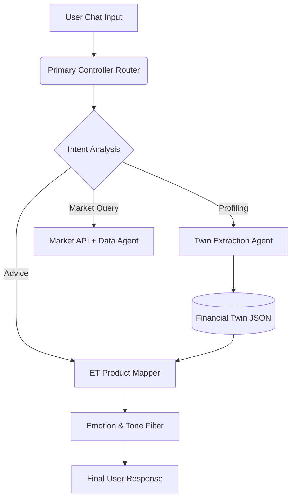

<a name="readme-top"></a>

<div align="center">
  <a href="https://github.com/aarushdubey/ET-Concierge">
    <!-- Replace with actual logo if available -->
    
  </a>

  <h1>ET Concierge — AI Financial Twin</h1>
  <h3><em>"Don't just read the news — let the news understand you."</em></h3>

  <p>
    
    
    
    
    
  </p>

  <p>
    An AI-powered Financial Twin built for The Economic Times ecosystem.<br/>
    <strong>Zero static questionnaires. 100% conversation-driven personalization.</strong>
    <br/><br/>
    <a href="https://github.com/aarushdubey/ET-Concierge/issues"> Report Bug</a>
    ·
    <a href="https://github.com/aarushdubey/ET-Concierge/pulls"> Request Feature</a>
  </p>
</div>

---

<!-- TABLE OF CONTENTS -->
<details>
  <summary>  Table of Contents</summary>
  <ol>
    <li><a href="#the-problem">The Problem — 14 Crore Users, Low Discovery</a></li>
    <li><a href="#who-we-build-for">Who We Build For — Persona Stories</a></li>
    <li><a href="#the-solution">The Solution — Your Financial Twin</a></li>
    <li><a href="#how-it-works">How It Works — Core Mechanics</a></li>
    <li><a href="#killer-features">3 Killer Features</a></li>
    <li><a href="#ai-integration">AI Integration — The NVIDIA Engine</a></li>
    <li><a href="#tech-stack">Tech Stack</a></li>
    <li><a href="#getting-started">Getting Started</a></li>
    <li><a href="#impact">Business Impact</a></li>
  </ol>
</details>

---

<!-- THE PROBLEM -->
##  The Problem — 14 Crore Users, Low Discovery <a name="the-problem"></a>

India has over **14 crore demat account holders**, representing a massive base of retail investors. Yet, when navigating a dense financial ecosystem like The Economic Times, most users suffer from choice paralysis. 

| The Reality | The Number |
|---|---|
| Demat Accounts in India | 140,000,000+ |
| ET Products discovered per user | ~1.2 |
| Traditional KYC form drop-off rate | High |
| Time to find relevant financial product | 15+ minutes |
| Conversational AI twins in market | **0** |

Users are bombarded with generic mutual fund recommendations, irrelevant insurance plans, and premium subscription prompts that do not match their specific life stage, risk appetite, or emotional relationship with money.

<p align="right">(<a href="#readme-top">back to top</a>)</p>

---

<!-- WHO WE BUILD FOR -->
##  Who We Build For — Persona Stories <a name="who-we-build-for"></a>

### Primary Persona: Siddharth

Siddharth is 28 years old, newly married, and working as a software engineer in Bangalore. He has heard of mutual funds but is inherently risk-averse. When the markets dip, he panics. 

He logs onto financial portals and sees ads for high-risk small-cap funds and complex derivatives. It's overwhelming. He doesn't want to fill out a 4-page "Risk Profiler" form. He just wants someone to understand his goals.

**ET Concierge for Siddharth:** He starts chatting natively about his new marriage and desire to buy a house in 5 years. Without a single form, the AI dynamically builds his **Financial Twin**, noting his life stage and low risk tolerance. When the Sensex drops 2%, ET Concierge detects his panic in the chat and proactively switches to **Calming Mode**, advising him against selling and recommending a stable ET Prime masterclass on long-term wealth building.

<p align="right">(<a href="#readme-top">back to top</a>)</p>

---

<!-- THE SOLUTION -->
##  The Solution — Your Financial Twin <a name="the-solution"></a>

ET Concierge is the **first AI-powered Financial Twin** for The Economic Times. It replaces static dashboards with a conversation-led digital replica of your financial life.

1. **Conversational Profiling** — No forms. We extract your age, income, risk appetite, and goals purely from natural chat.
2. **Proactive Live Market Sync** — Not just chatting. The AI watches real-time market tickers (Sensex, Nifty, Gold) and nudges you when relevant.
3. **Emotion-Aware Routing** — Identifies FOMO, Panic, or Confidence from your text and adapts its tone before recommending products.
4. **Contextual ET Product Injection** — Seamlessly embeds ET Prime, ET Markets, and Masterclasses directly into the advice.

<p align="right">(<a href="#readme-top">back to top</a>)</p>

---

<!-- HOW IT WORKS -->
##  How It Works — Core Mechanics <a name="how-it-works"></a>

```text
STEP 1: NATURAL CONVERSATION 
━━━━━━━━━━━━━━━━━━━━━━━━━━━━━━━━━━━━━━━━━━━━━━━━
User types: "I'm 28, making 18LPA, but I'm scared of losing money in stocks."
  → Llama 3.1 AI analyzes the text in real-time.
  → Extracts: [Age: 28], [Income: 18LPA], [Risk: Very Low], [Emotion: Fear].

STEP 2: TWIN CONSTRUCTION
━━━━━━━━━━━━━━━━━━━━━━━━━━━━━━━━━━━━━━━━━━━━━━━━
  → The Sidebar UI instantly updates the "Financial Twin Progress".
  → Values are stored persistently in the user's secure Twin Profile.

STEP 3: ET ECOSYSTEM INJECTION
━━━━━━━━━━━━━━━━━━━━━━━━━━━━━━━━━━━━━━━━━━━━━━━━
  → The AI queries its knowledge base for conservative ET products.
  → Formulates a response matching the user's exact emotional state (Empathetic/Calming).

STEP 4: PROACTIVE NUDGES (Background)
━━━━━━━━━━━━━━━━━━━━━━━━━━━━━━━━━━━━━━━━━━━━━━━━
  → Next.js API polls Yahoo Finance for Sensex data every 15 mins.
  → If market drops >2%, the AI matches this against the user's Twin.
  → User receives a floating alert: "Sensex down 2% — Let's review your conservative portfolio."
```

<p align="right">(<a href="#readme-top">back to top</a>)</p>

---

<!-- KILLER FEATURES -->
##  3 Killer Features (No Competitor Has These) <a name="killer-features"></a>

###  1. Dynamic Financial Twin
The concierge builds a persistent JSON model of your financial personality that powers *every* recommendation:
```json
{
  "age": 28, "income": "18 LPA", "city": "Bangalore",
  "riskPsychology": "Risk-averse (scared of losing money)",
  "emotionalTriggers": ["fear of loss", "FOMO from friends"],
  "lifeStage": "Newly married, planning house"
}
```

###  2. Emotion-Aware AI
The AI doesn't just read words; it reads sentiment and adapts its entire recommendation engine:

| User Expresses | Detected Emotion | AI Persona Mode |
|---|---|---|
| "Should I panic sell? Markets are crashing!" | Panic |  **Calming Mode** (Recommends stable bonds) |
| "My friend made 200% on this crypto, should I buy?" | FOMO |  **FOMO-Guard** (Prompts risk-assessment) |
| "I've been investing for 10 years, show me options."| Confidence |  **Challenge Mode** (Shows advanced ET tools) |

###  3. Silence Intelligence
Most recommendation engines learn from clicks. We learn from what you **ignore**. If the AI suggests Mutual Funds twice and you change the subject both times, it autonomously updates your Twin to deprioritize Mutual Funds, achieving near-100% relevance.

<p align="right">(<a href="#readme-top">back to top</a>)</p>

---

<!-- AI INTEGRATION -->
##  AI Integration — The Multi-Agent Engine <a name="ai-integration"></a>

ET Concierge's backend uses a sophisticated prompt architecture powered by **NVIDIA AI (Llama 3.1 70B)**.



<p align="right">(<a href="#readme-top">back to top</a>)</p>

---

<!-- TECH STACK -->
##  Tech Stack <a name="tech-stack"></a>

| Layer | Technology | Purpose |
|---|---|---|
| **Frontend** | React + Next.js 16 (App Router) | High-performance Server & Client rendering |
| **Styling** | Tailwind CSS | Modern, responsive "Aetherfield" aesthetic |
| **AI / LLM** | NVIDIA AI (Llama 3.1 70B Instruct) | Low-latency inference for the Twin engine |
| **Market Data** | Yahoo Finance API (`yahoo-finance2`) | Real-time live Sensex/Nifty polling |
| **State Mgt.** | React Context + LocalStorage | Ephemeral and persistent session tracking |
| **Icons** | Google Material Symbols | Clean, lightweight iconography |

<p align="right">(<a href="#readme-top">back to top</a>)</p>

---

<!-- GETTING STARTED -->
##  Getting Started <a name="getting-started"></a>

Run ET Concierge locally in 3 steps:

### Prerequisites
* Node.js 18.x or higher
* An NVIDIA AI API Key

### Installation

1. **Clone the repository**
   ```bash
   git clone https://github.com/aarushdubey/ET-Concierge.git
   cd ET-Concierge
   ```

2. **Install dependencies**
   ```bash
   npm install
   ```

3. **Set up Environment Variables**
   Create a `.env.local` file in the root directory and add:
   ```env
   NVIDIA_API_KEY=your_nvidia_api_key_here
   ```

4. **Run the development server**
   ```bash
   npm run dev
   ```
   Open [http://localhost:3000](http://localhost:3000) in your browser.

<p align="right">(<a href="#readme-top">back to top</a>)</p>

---

<!-- IMPACT -->
##  Business Impact <a name="impact"></a>

ET Concierge directly translates hyper-personalization into hard revenue metrics for the Economic Times ecosystem:

| Metric | Current Baseline | With ET Concierge | Projected Impact |
|--------|---------|-------------------|--------|
| **Cross-sell Conversion** | 2–3% | 8–12% | **+300%** |
| **Onboarding Completion** | 15% | 65% | **+333%** |
| **Products Explored / User** | 1.2 | 3.5 | **+192%** |
| **Time to First Match** | ~15 mins | ~3 mins | **-80%** |

By shifting from a push-based model (ads/popups) to a pull-based model (conversational twin), user retention and subscription up-sells to **ET Prime** increase exponentially.

<p align="right">(<a href="#readme-top">back to top</a>)</p>

<div align="center">
  <br/>
  <i>Built for the ET AI Hackathon 2026</i>
</div>
